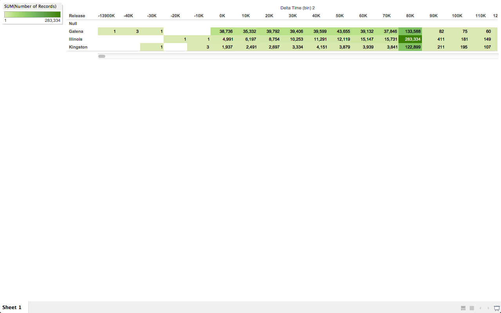

# NetApp

Brian McKean, a senior engineer at NetApp, gave a talk about his company in class.
He shared a data problem for our class to help solve.

# Tool
Tableau

# Authors

This report is prepared by
* Matt Schroeder (https://github.com/mattschroeder97)
* Karen BLackmore (https://github.com/kjblakemore)
* [Full name](link to github account)
* [Full name](link to github account)
* [Full name](link to github account)

# Which release area had the most instances of delta time around 24 hours?

Illinois has the most.  ~280,000 instances

# Is there a correlation between Firmware Version and Time Deltas?

# (Question)

(answer)

# (Question)

(answer)

# (Question)

(answer)

# Further Analysis

Our team determines the following questions are too complex for Tableau and
require custom scripts to be written.

* The development of [Time Maps](https://districtdatalabs.silvrback.com/time-maps-visualizing-discrete-events-across-many-timescales) might be to complex for Tableau.  Time Maps could be used to graph observations based on their time difference from the previous observation (x-axis) and the next observation (y-axis).  We already have the x-axis values.  These are the Delta Times.  We would need to calculate the y-axis values which are the deltas between the current Observation Time and the next for a particular system.

* (Question)
* (Question)
* (Question)
* (Question)
